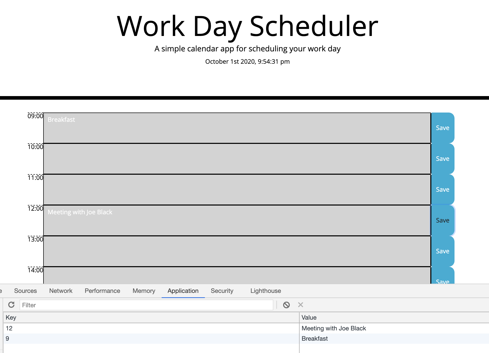

# work-day-scheduler

Simple interface for scheduling your workday.

# How Does It Work?
Enter your task in a time-slot and click save button to have it saved in your localStorage.

# Links:

* [repo on GitHub](https://github.com/samergain/work-day-scheduler)
* [deployed application](https://samergain.github.io/work-day-scheduler/)

# Screenshot 

# Future Improvements:
* Add a "clear data" button to clear the page 
* Add 24 hours time-slots
* Add full calendar
* Add browser notifications

# Credit & Sources
* Big THANK YOU to Josh Thorngren and Meena Ambalam for helping with the layout.
* Bootstrap 4 - used for main layout and elements
* [jQuery docs for selectors](https://api.jquery.com/attribute-contains-selector/)
